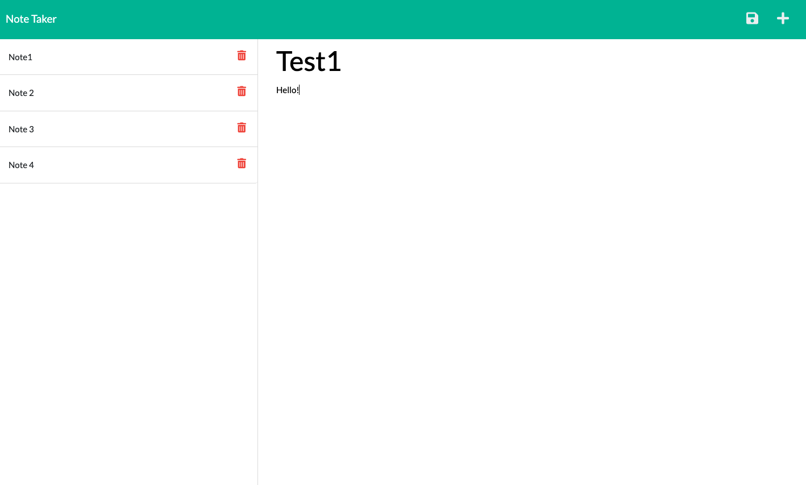

 # Note Taker  
  

## Description
This project is a note taking app where you are able to write, save, and delete the notes right on the deployed webpage. This application uses Express.js back end and will save and retrieve note data from JSON file.

## Table of Contents
- [Installation](#installation)
- [Usage](#usage)
- [Contributing](#contributing)
- [Tests](#tests)
- [Questions](#questions)
- [License](#license)  

## Installation
You will need to run npm i to install the requried third party packages and require file system, util, and path which are built in packages.

## Usage
This application is run using the web browser.
<ul>
<li> Use either the given url (found at the bottom of this page), or open up your integrated terminal and launch the app on your local server.</li>
<li>Once the application is open you will see the homepage, click get started, which will take you to the notes page.</li>
<li>Add a title for your note in the "Note Title" section, and below that add the note you would like to remember, then click the save icon in the top right corner of the screen.</li>
<li>This will add the note to the left hand side of the screen and open up a space to add another note.</li>
<li>If you would like to see a previous note you wrote, click on it and it will show up on the right side of the screen. Here you can edit the note if you need. If you are looking at a note but would like to start a new note, click the plus in the top right hand corner of the screen. </li>
<li>If you would like to delete a note, click the trash can and your note will be deleted</li>
<li>If the page is refreshed, the notes will stay on the page. </li>
</ul>

## Links to Application
<a href="https://github.com/smturner/express.js_note_taker">GitHub Repo</a>

<a href= ">

## Questions  
If you have any questions about this project, please email me directly at turnersarah228@gmail.com.

You can view more of my projects at https://github.com/smturner.

## License
Copyright (c) 2022 Sarah Turner

This application is licensed by MIT. For more information on this license, visit <a href= "(https://opensource.org/licenses/MIT)">Open Source MIT</a>.  